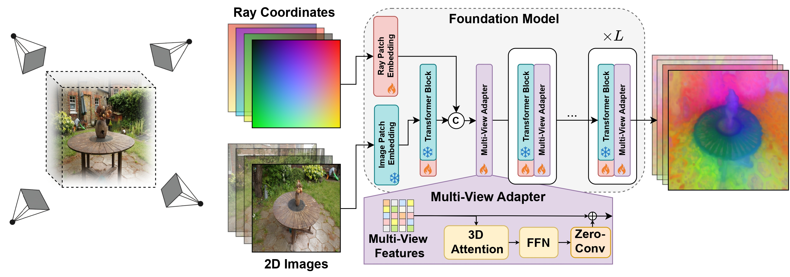

# Multi-View Foundation Models

By *[Or Hirschorn](https://scholar.google.co.il/citations?user=GgFuT_QAAAAJ&hl=iw&oi=ao), *[Leo Segre](https://scholar.google.com/citations?user=A7FWhoIAAAAJ&hl=iw) and [Shai Avidan](https://scholar.google.co.il/citations?hl=iw&user=hpItE1QAAAAJ)  </p>

This repo is the official implementation of "[Multi-View Foundation Models](https://arxiv.org/pdf/TBD.pdf)" (Link TBD).

<p align="center">

</p>

## Introduction
We introduce a novel framework that transforms existing 2D Foundation Models (like DINO, SAM, and CLIP) into Multi-View Foundation Models. Current 2D models process images independently, leading to inconsistent feature representations for the same 3D point viewed from multiple camera angles.

## Setup/Install
We recommend using Anaconda or Miniconda. To setup the environment, follow the instructions below.
### Create environment
```bash
conda create --name multi_view_foundation_models -y python=3.10
conda activate multi_view_foundation_models
pip install torch==2.8.0 torchvision torchaudio --index-url https://download.pytorch.org/whl/cu128
pip install -r requirements.txt
pip install -e .
```

### Demo
To run the demo on a sample scene (Pikachu), use the command below. It will download the Pikachu scene and the pretrained DINOv2_reg model and run a visual correspondence comparison.
```bash
python demo.py
```


### Data
Download the Generalization dataset from this [link](https://drive.google.com/file/d/1VhC3M9NcrVqXzefFTuTUF7yTvuEd_3jq/view?usp=sharing).

For the ScanNet++ dataset - each new user needs to submit application to request access to ScanNet++ from its [official website](https://scannetpp.mlsg.cit.tum.de/scannetpp/). According to the Terms of Use of ScanNet++, we can only share the preprocessed data with people who have also signed the Terms of Use and been granted access to ScanNet++. After you submit your application and get approved from the ScanNet++ team, you can Forward the approval email to leosegre@mail.tau.ac.il and then we will share our preprocessed data with you directly.

### Extact Features
To extract features from images using a specific foundation model, run the following command. For example, for DINOv2:
```bash
python test/extract_features.py --exp_name dinov2_reg --colmap_path {path/to/data/root/dir} --exp_directory experiments --scene pikachu --load_pretrained
```

### Training
Run the relevant experiment, for example for DINOv2:
```bash
python train/train_dino.py --exp_name {exp_name} --colmap_path {path/to/data/root/dir} --exp_directory {path/to/exp/dir} --config_name dinov2_reg.yaml
```
If you don't have the camera parameters, try our the no-pose version:
```bash
python train/train_dino_nopose.py --exp_name {exp_name} --colmap_path {path/to/data/root/dir} --exp_directory {path/to/exp/dir} --config_name dinov2_reg_no_plucker.yaml
```

### Testing
```bash
python test/test_3d.py --exp_directory {exp_dir} --exp_name {exp_name} --colmap_path {path/to/data/root/dir} --results_dir {path/to/results/dir} --compare_to_base --fit3d
```

To test on our pretrained models, use the below command (You can change the model type by changing the exp_name to {dinov2_reg, dinov2_reg_no_plucker, dinov3, clip, sam}).
```bash
python test/test_3d.py --load_pretrained --exp_directory {exp_dir} --exp_name dinov2_reg --colmap_path {path/to/data/root/dir} --results_dir {path/to/results/dir} --compare_to_base --fit3d
```

If you don't have the camera parameters, try our the no-pose version:
```bash
python test/test_3d_nopose.py --load_pretrained --exp_directory {exp_dir} --exp_name dinov2_reg_no_plucker --colmap_path {path/to/data/root/dir} --results_dir {path/to/results/dir} --compare_to_base --fit3d
```


## BibTeX
If you find our models useful, please consider citing our paper!
```
TBD
```
